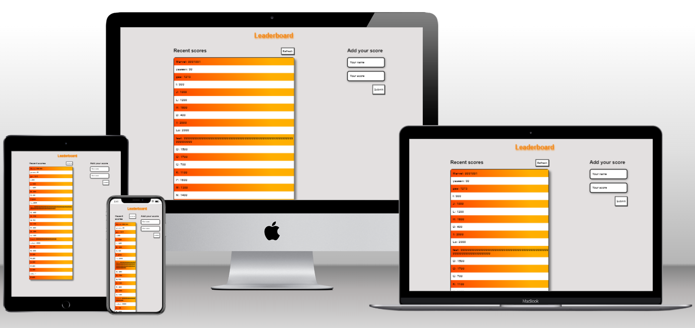

# leaderboard


# Leaderboard

> This is a Leaderboard site that displays scores submitted by different players. It was built with HTML, CSS, JavaScript &amp; the Leaderboard API.

## Built With

- Webpack
- HTML5
- CSS3
- JavaScript
- Git
- Leaderboard API

## Preview



## Live Demo

[Live Demo Link from ./dist/index.html](https://chelmerrox.github.io/leaderboard/dist/)

## Getting Started

To get a local copy up and running follow these simple example steps.

### Prerequisites

- Webpack
- HTML5 & CSS3 
- JavaScript
- Leaderboard API
- VSCode (or any other text editor)
- Git
- GitHub
- Command line/Terminal

### Setup

From the command line, do the following steps below:

1. Clone the projects' repository into your machine.

```bash
# Clone this repository
$ git clone git@github.com:chelmerrox/leaderboard.git

```
2. Change directory/Go into the repository with the command below.

```bash
$ cd leaderboard

```

3. Run this command.

```bash
$ npm run build

```

4. Run this to deploy the site on your local machine.

```bash
$ npm start

```

## Author

👤 **Losalini Rokocakau**

- GitHub: [@chelmerrox](https://github.com/chelmerrox)
- Twitter: [@chelmerrox](https://twitter.com/chelmerrox)
- LinkedIn: [Losalini Rokocakau](https://linkedin.com/in/losalini-rokocakau)

## 🤝 Contributing

Contributions, issues, and feature requests are welcome!

Feel free to check the [issues page](https://github.com/chelmerrox/leaderboard/issues).

## Show your support

Give a ⭐️ if you like this project!

## Acknowledgments

- My God & family
- Microverse
- Coding & Learning Partners: 
  1. []() 
  2. []() 
- Morning Session Teams
- Stand-Up Teams
- Microverse TSEs

## 📝 License

This project is [MIT](./MIT.md) licensed.
